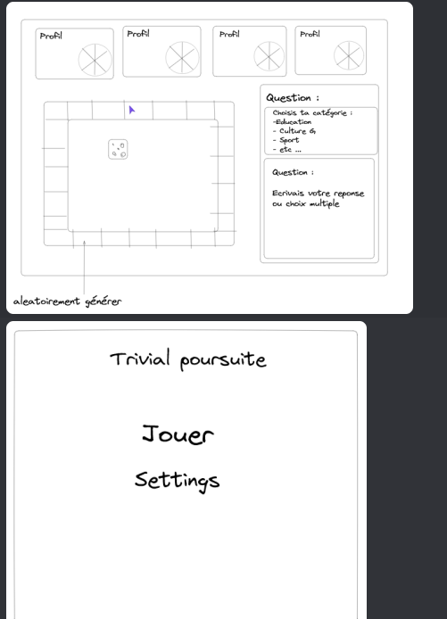

# **Projet AWS : Trivial Pursuit**

Jeux de Plateau de Quizz

## Maquette

Groupe 5 : BRICE Corentin, DJEBLAHI Ahmed, GUERIN Raphael, SAID Wail Rachad.

Notre projet est un jeu inspiré du Trivial Poursuite sur navigateur Web. Le jeu se jouera jusqu'à 4 joueurs en ligne (ou contre des IA). Il se déroule sur un plateau, chaque case contient une catégorie différente (Sport, Literrature, Musique etc..). Pour se déplacer sur le plateau les joueurs lance un dé à 6 faces. Les questions seront soit des questions à choix multiples, soit des questions attendant une réponse écrite. Pour gagner chaque joueur dispose d'un camembert, il faut répondre à chaque type de question pour obtenir la part de camembert corespondant. Une fois le camembert remplit le joueur gagne.

## **Semaine** 1 :

### **Les Codeurs** (BRICE Corentin, DJEBLAHI Ahmed) :

Pour cette première semaine le but est de créer la partie Front de notre site. C'est-à-dire, créer toute la partie graphique du site, les pages, les boutons, autrrement toute l'interface graphique visible par le client. 

Les Codeurs ont commencer par le Menu Principale du jeu. Cette première page est la première page lorsque l'on arrive sur le site. Elle affiche pour le moment le bouton "jouer" qui permet de changer de page, vers la page du choix du nombre joueurs. Cette partie là ne nous a pas poser de difficulté.

Ensuite, la page2 qui contient, comme dit précédement, les boutons permetant de sélectionner le nombre de joueurs et d'afficher en consequence le nombre de profils correspondant dans la maquette. On peut donc jouer à 2, 3 ou 4 personnes. Cette partie nous à posé pas mal de difficulté avec le CSS. Il à été difficile de positionner les boutons à l'emplacement exacte souhaité, avec les bonnes distances entre les boutons mais aussi avec les bords de l'écran.

Après cela nous avons décidé de créer les differents profils dans la maquette. Au début nous avons commencé par créer les différents profils. Puis nous avons commencé à faire les célèbre camembert du Trivial Poursuite. Mais nous avons eu des difficulté avec la forme des parts du camembert. Après elles étaient superposées nous avons dû chercher comment les séparer et faire en sorte qu’elles ne se superposent plus. Pour le cercle en lui même pas de problème, après c’était de l’ajustement. Par contre pour la mise en place c’était une autre histoire, encore une fois le positionement nous à poser des soucis.

Le Plateau lui nous à pris du temps. Malgré les nombreuses recherches sur le sujet, il a été difficile de trouver la bonne méthode à utiliser. Après avoir modifier plusieurs fois le code, nous sommes revenu sur le tableau fait un TD. Le plateau n'est pas encore parfait mais c'est un bon début.

### **Le Chercheur** (GUERIN Raphael) :

Du côté des recherches, dans cette première semaine, le but était d'aider et de prévoir la suite pour le site. J'ai donc rechercher un peu tous les sujets sur lesquels ont avaient des difficultés (boutons , css, positionnement, etc...). Notamment sur le plateau qui a été la plus grosse difficulté de la semaine. 

Mais aussi des moyens pour héberger le site et stocker ces données. Il existe un grand nombre de site permettant d'héberger gratuitement, ceux qui nous on les plus attiré sont : Google Cloud (Firebase, Cloud Run), AWS (Amazon Web Services) et FreeHosting. Ces sites on la particularité de rester gratuit à vies, son facile à utiliser pour un débutant et propose des services largement suffisant pour notre utilisation. 

Il est maitenant possible d'héberger son site chez soit. Il nous faut un ordinateur et une box. Pour cela on peut utilisé Apache, pour lier notre site à l'adresse IP de notre Box. Toute fois cette méthode est dépendante de l'ordinateur sur lequel on Host le site et sur la Box. De plus il se pose des questions de sécurité, en effet si l'on veut que l'adresse IP privé ne soit pas visible il faut acheter un nom de domaine.

Enfin une autre façon de faire est d'utilisé un vieux ordinateur et de le convertir en server. Mais il y a plusieurs problèmes avec cela, il faut que l'ordinateur reste allumer 24h/24 pour que le site soit tous le temps accessible. Et il faut une certaine configuration (carte réseau, carte mère etc...).

En résumé pour le moment, la méthode la plus interessante serait de faire héberger notre server par un site tiers.

Suite à cela il à donc fallu réfléchir aux façons de sécuriser notre site, en particulier les parties. Pour sécuriser encore plus notre site, il faudrait chiffrer le fichier contenant les réponses et les réponses. Elles seraient du coup inaccessible aux joueurs et ne serait déchiffrer que lors des affichages. Ainsi même si le joueur accède au fichier sur le serveur, il ne pourra pas tricher.  
Pour encore plus sécurisé le site on pourrait obliger aux joueurs de créer un compte. Ainsi les joueurs auront moins envie d'essayer de tricher. Il nous sera aussi possible de bloquer les joueurs ayant tricher.

### **Le Responsable** (SAID Wail Rachad) :

Avant de se lancer dans la programmation de Trivial Poursuite, nous avons mis en place un outil de gestion de tâches appelé Monday. Cet outil nous permet de répartir et de planifier les tâches à réaliser. Nous avons choisi de manière unanime de travailler sur le jeu Trivial Poursuite. SAID, notre chef de projet, a ensuite réparti les différentes tâches entre les codeurs et fourni des indications aux chercheurs pour leurs recherches. Tout au long de la semaine, il a suivi l'avancement des tâches et ajouté de nouvelles tâches lorsque nécessaire.

 

Les Sources et Sites des recherches :
-----
La page Principal :
- https://www.w3schools.com/js/js_window_location.asp
- https://developer.mozilla.org/en-US/docs/Web/CSS/clip-path
- https://www.pierre-giraud.com/html-css-apprendre-coder-cours/position/

Les boutons : 
- https://www.w3schools.com/tags/tag_button.asp
- https://www.w3schools.com/css/css_align.asp
- https://openclassrooms.com/forum/sujet/html5-bouton-vers-mon-autre-page
- https://developer.mozilla.org/fr/docs/Web/API/EventTarget/addEventListener#exemples

Le Plateau de jeu :
- https://www.youtube.com/watch?v=6RTrfunUiH4
- https://codepen.io/johnnycopes/pen/yzQyMp
- https://github.com/intrepidcoder/monopoly
- https://developer.mozilla.org/fr/docs/Web/HTML/Element/td
- https://developer.mozilla.org/fr/docs/Web/HTML/Element/table
- https://developer.mozilla.org/fr/docs/Web/HTML/Element/tr

Les camembert : 
- https://developer.mozilla.org/en-US/docs/Web/CSS/transform-function/rotate

Les possibles hebergeurs : 
- https://firebase.google.com/docs/build?hl=fr
- https://www.wpbeginner.com/showcase/best-free-website-hosting-compared/
- https://www.freehosting.com/free-hosting.html
- https://www.one.com/en/hosting/host-your-own-website

SEMAINE 2
Résumé semaine 2 :

Les Codeurs (BRICE Corentin, DJEBLAHI Ahmed) :

Pour cette deuxième semaine, les codeurs ont poursuivi le développement du projet Trivial Poursuite en se concentrant sur la partie back-end. Ils ont ajouté un fond d'écran sur les pages avec des images ou des couleurs, ainsi que des boutons sur la deuxième page permettant de récupérer et de sauvegarder une partie dans la base de données Firebase Cloud Firestore. Ils ont également ajouté une case sur la droite de la page de jeu pour afficher les questions et une barre de texte pour que l'utilisateur puisse donner sa réponse à la question.

Ils ont développé la fonctionnalité de création de partie pour l'utilisateur avec un identifiant unique de partie et la possibilité de charger une partie existante en utilisant l'ID du jeu. Ils ont référencé les valeurs du dé et de l'avancement de la partie dans la base de données, et ont réussi à afficher une question de la base de données avec vérification de sa réponse. De plus, ils ont créé le dé avec JavaScript permettant de sortir un nombre aléatoire entre 1 et 6 et l'ont positionné au centre du plateau.

Ils ont également effectué un premier test hors ligne pour la création d'un tableau avec JavaScript en vue des prochaines séances. Cependant, ils ont rencontré des problèmes de placement d'objets avec CSS, notamment sur la taille de ceux-ci, et ont eu des difficultés sur la création du plateau à l'aide de JavaScript (en développement mais pas présentable). Ils ont également rencontré des difficultés pour bien faire le fond d'écran de la page d'accueil, en raison des dimensions de l'image à respecter.

Le Chercheur (SAID Wail Rachad) :

Le chercheur a continué à apporter son soutien à l'équipe en fournissant des informations précieuses sur divers sujets liés au projet, tels que les options d'hébergement et les mesures de sécurité. Il a identifié plusieurs options d'hébergement gratuites, notamment Google Cloud (Firebase, Cloud Run), AWS (Amazon Web Services) et FreeHosting, et a expliqué les avantages et les inconvénients de chacune. Il a également exploré des moyens de sécuriser le site, tels que le chiffrement du fichier contenant les réponses pour les rendre inaccessibles aux joueurs.

Le Responsable (GUERIN Raphael) :

Le chef de projet a continué de superviser les progrès de l'équipe et de veiller à ce que les tâches soient terminées dans les délais impartis. Il a utilisé l'outil de gestion de tâches Monday pour assigner des tâches et surveiller les progrès. Il a guidé les codeurs et le chercheur au besoin et a apporté des ajustements au plan de projet au besoin. Dans l'ensemble, il a veillé à ce que le projet avance sans problème et de manière efficace.

Source
Firebase Auth :

-https://firebase.google.com/docs/auth?hl=fr

-Dev côté serveur:

https://developer.mozilla.org/fr/docs/Learn/Server-side/First_steps/Introduction

-CSSpadding:

https://developer.mozilla.org/fr/docs/Web/CSS/padding

-CSS float

https://developer.mozilla.org/fr/docs/Web/CSS/float

-Html input 

https://developer.mozilla.org/fr/docs/Web/HTML/Element/input

-Data firebase

https://firebase.google.com/docs/firestore/manage-data/add-data?hl=fr#web-version-9_1

-Retrieve Data Firebase

https://firebase.google.com/docs/firestore/query-data/get-data?hl=fr

-Bug firebase réso

https://stackoverflow.com/questions/57941289/how-do-i-solve-error-failed-to-list-firebase-projects-see-firebase-debug-log

-Tuto Firebase

https://www.youtube.com/watch?v=x922y6F7wzo

-Css Size

https://developer.mozilla.org/fr/docs/Learn/CSS/Building_blocks/Sizing_items_in_CSS
